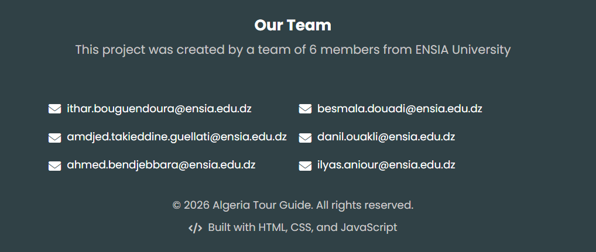
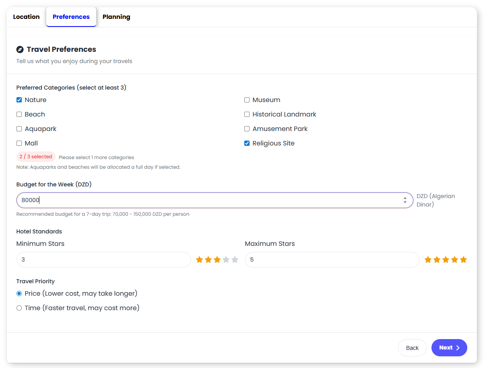
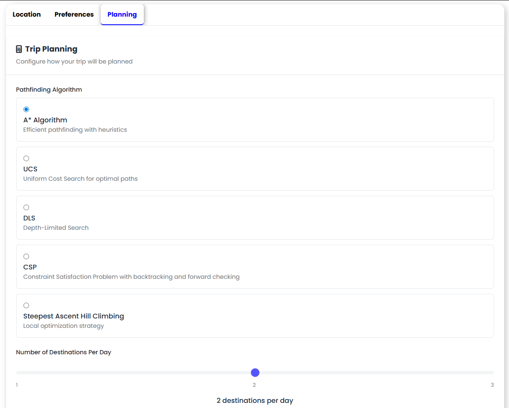
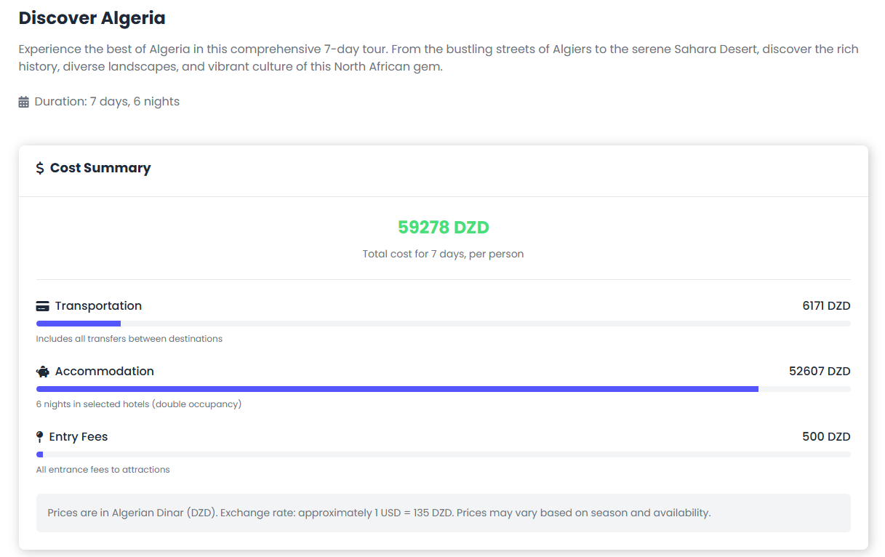
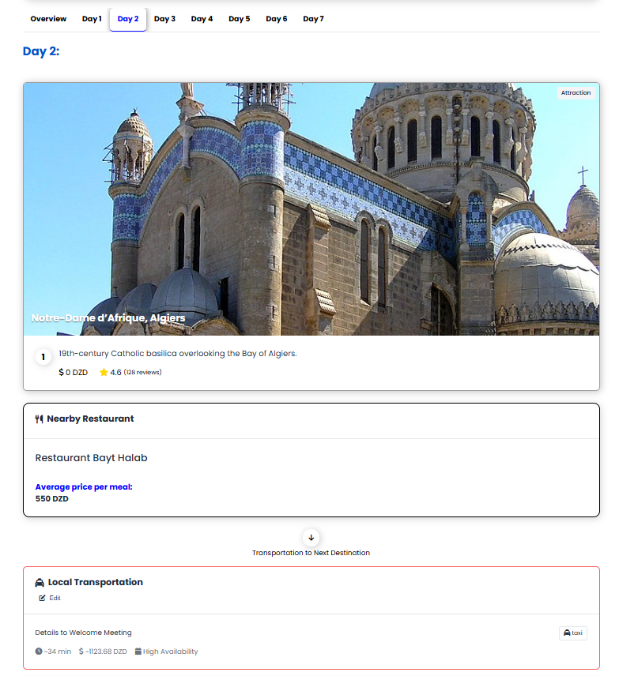
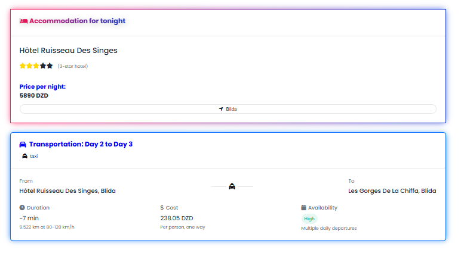

## Algeria Smart Travel Planner

A web application that generates personalized 7-day travel itineraries across Algeria, optimizing routes based on user preferences, proximity, and budget.
Users input their location, interests, and hotel preferences, and the app builds a day-by-day itinerary avoiding repeat visits and respecting cost and time constraints.
What we built:

An attraction database with GPS coordinates, categories (nature, history, beaches, etc.), ratings, and cost estimates
An objective function balancing travel time, cost, and user satisfaction
Multiple AI search algorithms — BFS, DFS, A*, IDA*, and Hill Climbing — with a comparative performance analysis
A CSP model for the scheduling constraints, compared against the search-based solutions
Route visualizations and cost breakdowns

#### My role: 
- Data collection & cleaning contribution
- Implementation of UCS Algorithm, and contribution in CSP modeling and implementation

## Local Setup

### Prerequisites
Make sure you have Python installed. Then install the required dependency:

```bash
pip install flask
```

### Run the app

```bash
python app.py
```

Then open your browser and go to: **http://127.0.0.1:5000**

## Team 



## Screenshots





